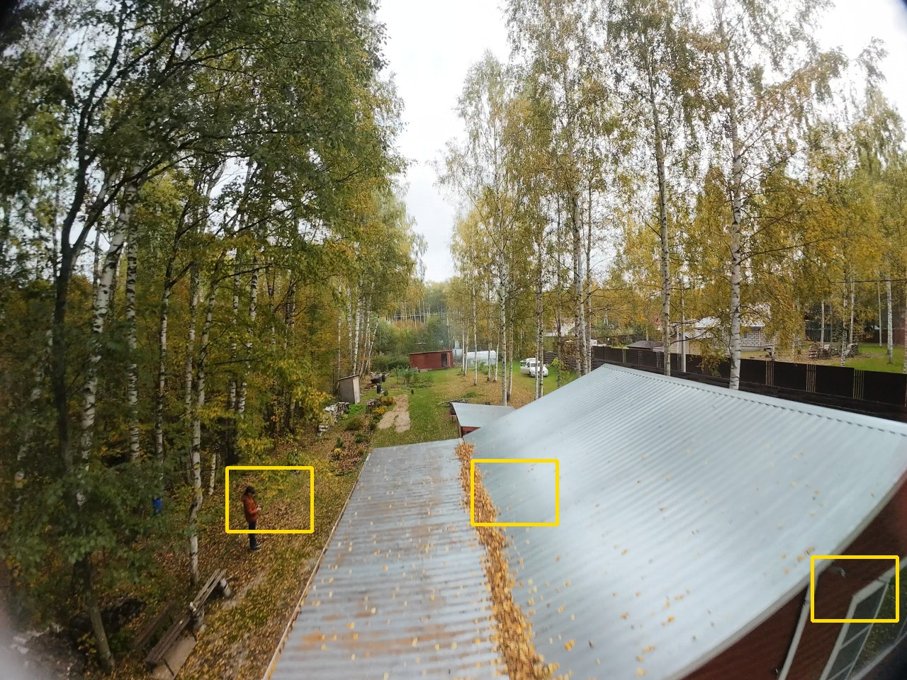
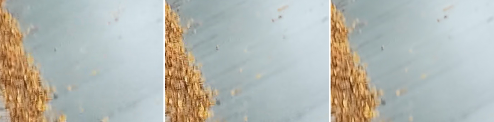
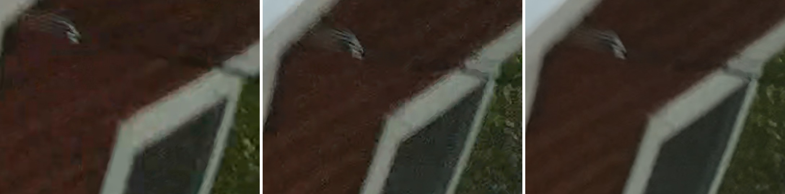
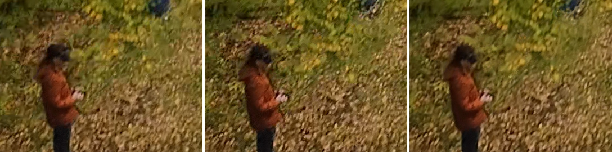
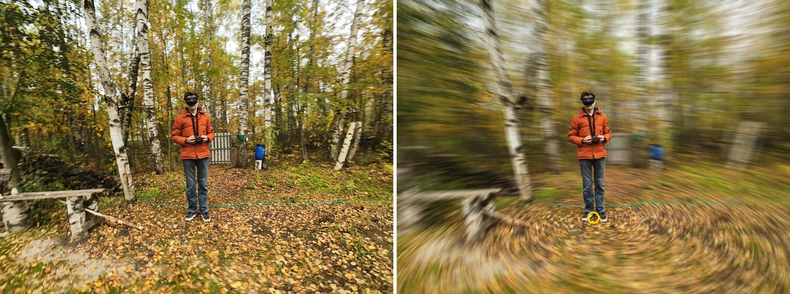

# SharpFrame: sharp photos from a video

[Русский](README.ru.md)

Pick a moment in a video, get the best photo the footage allows there. Not a screenshot: of
the frames within ±0.12 s the sharpest one is taken, and its neighbours, aligned to it, clean
up the noise and compression blocks where they agree with it.



## What you get

A fast flight at 1:23.6 of a 4K 50 fps clip, crops at 200 %. **Left:** the frame at that
moment, as a player shows it. **Middle:** SharpFrame. **Right:** SharpFrame, `soft`.



Leaves in the gutter. The frame at the moment is a compressed in-between frame: smeared
into blocks. Three frames later there is a crisp one, and that is the one SharpFrame takes
(the frame at the moment has 87 % of its sharpness).



The window: on the frame as is the siding is a blotchy smear; in the middle its texture and
a crisp edge of the frame are back. `soft` averages the neighbours more boldly: smoother,
with less of the fine texture.



Not always a win in every spot: here the person moved in those three frames and is a little
more blurred on the chosen frame, while the grass around is cleaner. The sharpest frame is
chosen for the picture as a whole.

## Motion

A long exposure by the moment: what moves in the picture streaks along its way, what stands
still in it stays sharp. It ends at the moment by default, so the streaks trail behind what
moves; it can also be centred on it (streaks both ways) or start at it. Flying forward, that is the point the camera heads for, with
everything streaming out of it; flying round a person, the person.



A flight round a person, 4K. **Left:** the photo at that moment. **Right:** motion, 1/8 s before
and after it, a click at the feet (the ring): the frames follow that spot, the person stays
sharp, the ground swirls round them.

It is one more stage after the photo itself: the reference frame and the merge stay as they
are. ~10 real frames spread over the exposure are steadied (the shake out, or held at the
clicked spot), each is smeared along its own motion over its slice of the exposure in steps of
≤ 1.5 px, and the slices are added up. Real frames rather than the one photo smeared: what is
hidden behind the person in the photo is there in the others, so no colour of theirs bleeds
into the streaks around them. Where nothing moves the full 4K photo stays, the edge between
the two following the picture's own edges (a colour-guided filter). About 20–25 s more per 4K
photo at 1/8 s; much longer exposures of a fast flight take longer and show ghosts of the
frames they are made of.


**Browser page.** Double-click `SharpFrame.bat` (or `python web.py`). Drop a video onto
the page, find the moment in the player (<kbd>,</kbd> <kbd>.</kbd> step one frame), press
**Take photo**. It appears below with **Save**; hold **Frame as is** to compare. **Soft**
switches on the soft look, **Motion** the long exposure (the slider: 1/60 to 1 s; before, around or after the moment); on a photo
with motion, click the spot to hold sharp. Many moments: **Add to list** (<kbd>+</kbd>) at each,
then **Take all**. The page is served by a local server on 127.0.0.1 only; the
video is copied into a temp folder while you look for the moment, and removed on exit.

**Command line.**

```bat
SharpFrame.bat clip.mp4 0:12 0:47.5 1:03.2
SharpFrame.bat my_job.json
python sharpframe.py clip.mp4 83.6 --soft --save-single-frame
python sharpframe.py clip.mp4 83.6 --motion-seconds 0.125 --motion-focus 0.65,0.6
```

Stills go to `<video name>_stills` next to the video, as `<video name>_<time>.jpg`.

**Options** come from [`sharpframe.json`](sharpframe.json) beside the script. A job adds the
video and the times, and its own `options` over those; the command line (with dashes:
`--sharpen-amount 0`) wins over both:

```json
{
  "video_file": "F:/clips/clip.mp4",
  "times": ["0:12", "0:47.5", "1:03.2", "81.4"],
  "options": {"soft": true}
}
```

| key | meaning |
|---|---|
| `video_file` | the video; absolute, or relative to the JSON |
| `times` | `"0:12"`, `"1:03.5"`, `"0:01:03.5"` or seconds (`81.4`) |
| `output_folder` | where the stills go; `""` = `<video name>_stills` next to the video |
| `soft` | merge the neighbours boldly: a smoother, dreamier picture with less fine detail |
| `motion_seconds` | a long exposure of this many seconds ending at the moment; `0` = off |
| `motion_when` | the exposure `"before"` the moment (default), `"around"` it or `"after"` it |
| `motion_focus` | `"x,y"` in fractions of the frame (`"0.5,0.5"` = the centre) held sharp with `motion_seconds`; `""` = what stands still in the picture |
| `search_window_seconds` | frames within this many seconds on each side of the time are looked at (0.12) |
| `max_frames_to_merge` | frames merged at most, the sharpest one included (9) |
| `min_relative_sharpness` | frames less sharp than this share of the sharpest one are left out (0.75) |
| `merge_tolerance` | multiplies the threshold: higher averages more, lower keeps more of the sharpest frame (1) |
| `sharpen_amount`, `sharpen_radius_px` | unsharp mask; `0` = off (0.6, 1 px) |
| `lut_file` | `.cube` colour LUT applied at decode, e.g. a log profile to Rec.709; `""` = none |
| `save_single_frame` | also save the sharpest frame alone (`<name>_single_frame`), to see what merging gave |
| `passthrough` | for tests: the frame at the time as decoded (LUT included), nothing else done (`<name>_passthrough`) |

## How it works

For each time:

1. the frames within ±0.12 s are decoded at full bit depth (10-bit to 16-bit RGB, with the
   4:2:0 colour upsampled at its true position);
2. the sharpest one becomes the reference, so a motion-blurred or heavily compressed frame at
   exactly that instant is not the one you get; a frame at the window's edge has to be ~18 %
   sharper to win, the moment being what you chose. On an ordinary clip this is the larger part
   of the gain: the frame at an arbitrary moment is often an in-between one, blurrier and
   blockier than the keyframe a few frames away;
3. the other sharp frames are aligned to it with dense optical flow (DIS);
4. they are averaged in per pixel only where they show the same thing: where the local energy
   of the difference to the reference (a blurred square, which fine texture shifted by half a
   pixel cannot cancel out) stays within 3× the noise level, read off the best-aligned tenth of
   the picture. So a sky, a wall, a roof lose their noise, while leaves in the wind, moving
   people and flow errors keep the reference's own pixels. `soft` compares a blurred signed
   difference with 2.5× its median instead: fine texture passes as "the same" and is averaged,
   hence the smoother look;
5. an unsharp mask, JPEG at quality 96.

**The test.** Independent noise added to every frame of the example (σ 3 % of the range), the
result compared with the clean reference frame: the one sharpest frame 33.9 dB, SharpFrame
36.3–36.5 dB, `soft` 32.3 dB. With no noise added SharpFrame stays at 58 dB from the frame it
started from: it does not smear texture. On clean daylight 4K the merge adds little; the dimmer
and noisier the footage, the more it does.

An upscale mode was tried and dropped: averaging the neighbours onto a twice finer grid did not
beat plain bicubic of the one sharpest frame.

Speed: 12-20 s per photo on a 4K clip (12-core Xeon), most of it decoding and the optical flow.

## Setup

```bat
python -m venv .venv
.venv\Scripts\pip install -r requirements.txt
```

`av` (PyAV, FFmpeg's decoder inside the wheel: no ffmpeg to install), `opencv-python-headless`,
`numpy`. Python 3.11.

## For others

The ready zip is on the [Releases](https://github.com/parhipov/SharpFrame/releases) page:
unzip anywhere, run `SharpFrame.bat`, nothing to install (Windows 10/11, 64-bit).

A version tag builds and publishes it (`.github/workflows/release.yml`):
`git tag -a v1.1 -m "what changed" && git push origin v1.1`.

By hand, `build_zip.ps1` makes `dist\SharpFrame.zip` (~80 MB): embedded Python with the
`.venv`'s packages, the scripts, the page and `README.txt`.

```bat
powershell -ExecutionPolicy Bypass -File build_zip.ps1
```
